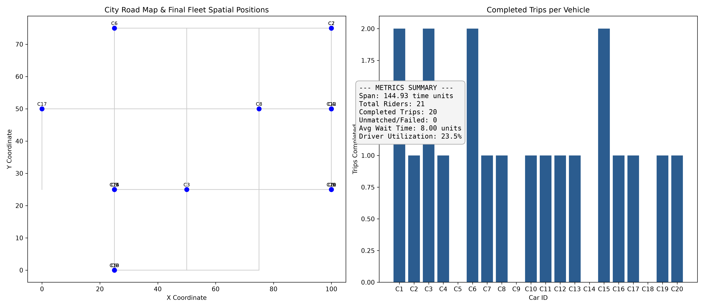
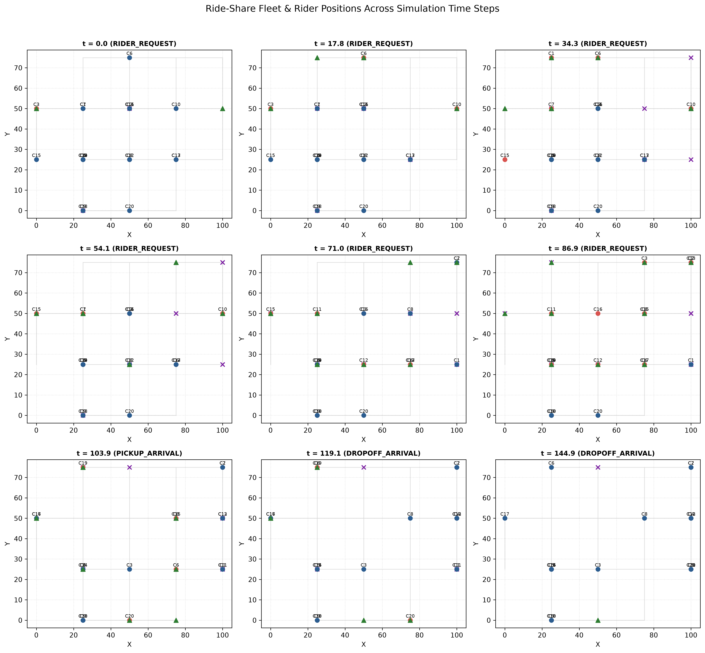

# Project Title: Ride Share Simulation Application

## Purpose/Design: 
This application simulates an automated, discrete-event ride-sharing dispatch system. The engine integrates a **Quadtree spatial index** for fast spatial candidate retrieval with **Dijkstra's Algorithm** for exact road network pathfinding. 

The engine processes events chronologically via a priority queue, manages concurrent car/rider state transitions, enforces strict availability data invariants across three synchronized lookup structures, and outputs analytical performance reports and summary visualizations.

---
## Map Data Format:
Ensure map.csv is present in the working directory with your desired network connections and travel times. In the below format.

 > #start_node,start_x,start_y,end_node,end_x,end_y,travel_time  
 > Main St,0.0,0.0,Broadway,4.0,0.0,5.0  
 > Broadway,4.0,0.0,Main St,0.0,0.0,5.0  
 > Main St,0.0,0.0,Oak Ave,0.0,-3.0,3.0  
#### Example Running a Custom Map:
`python simulation.py --graph-file Data/custom_map.csv`

## How to Run: 
Currently, the project is designed to be run in a Python environment. To execute the application, follow these steps:

### System Requirements
* **Python**: Version 3.8 or higher.

### Dependencies
Install the required third-party libraries using `pip`:  
`pip install -r requirements.txt`

### Running the Application

1. Ensure you have Python installed on your system.
2. Download or clone the project repository to your local machine.
3. Install any required dependencies listed in the requirements.txt file using the command: `pip install -r requirements.txt`.
4. Navigate to the project directory in your terminal or command prompt.
5. Ensure that the map.csv file is present in the working directory.
6. Run the main application script using the command: `python simulation.py`.

### Command-line options and examples

| Option | Type | Default Value | Description |
| :--- | :---: | :---: | :--- |
| `--num-cars` | `int` | `20` | Total number of vehicle fleet units to initialize on the map graph. |
| `--num-riders` | `int` | `30` | Maximum number of dynamic rider request events to generate. |
| `--candidate-count` | `int` | `5` | Candidate pool size (k) queried from the Quadtree spatial index for Dijkstra route evaluation. |
| `--graph-file` | `str` | `Data/graph_xy.csv` | Relative or absolute path to the CSV file containing the city map network topology. |
| `--max-time` | `float` | `100.0` | Maximum simulation time cutoff. No new rider requests will be scheduled after this time. |
| `--seed` | `int` | `42` | Pseudorandom generator seed for deterministic, reproducible simulation runs. |
| `--snapshot-interval` | `float` | `15.0` | Time units between periodic snapshots. |

Example command to run the simulation with custom parameters:  
`python simulation.py --num-cars 50 --num-riders 100 --candidate-count 10 --seed 123 --max-time 200.0 --snapshot-interval 30.0`

## Event Types
**RIDER_REQUEST**: A rider requests a trip. Triggers candidate lookup, Dijkstra optimization, vehicle dispatch, and schedules the next dynamic rider request.  
**PICKUP_ARRIVAL**: A vehicle arrives at a passenger's starting location. Passenger enters the car, and the engine calculates the trip route to schedule drop-off.  
**DROPOFF_ARRIVAL**: A vehicle arrives at the passenger's final destination. Passenger trip completes, and the car is re-indexed back into availability structures.	  

## Four-Field Event Tuple  
**timestamp**: The simulation time at which the event occurs.  
**event_type**: The type of event being processed (RIDER_REQUEST, PICKUP_ARRIVAL, DROPOFF_ARRIVAL).  
**sequence_number**: A unique identifier for the event, ensuring chronological processing order.  
**data**: A dictionary containing relevant information for the event, such as rider ID, car ID, pickup location, and destination. 

## Car States
**available**: Stationary at a node, indexed in the Quadtree, ready for dispatch. 

**en_route_to_pickup**: Dispatched to pick up a passenger; removed from Quadtree availability.

**en_route_to_destination**: Carrying a passenger to their destination location.

## Rider States
**unassigned**: Initial state upon generation prior to request queue placement.

**waiting**: Request generated and driver assigned; waiting for vehicle pickup arrival.

**in_car**: Driver arrived at pickup location; currently traveling to destination.

**completed**: Successfully dropped off at final destination.

**unmatched**: No available drivers or no valid road path found at request time.

**unsuccessful**: Pickup occurred, but destination became unreachable due to routing failure.

## Definitions of reported metrics

* **span**: The total duration of the simulation from the first event to the last event processed.
* **total_riders**: The total number of rider requests generated during the simulation.
* **completed_riders**: The number of riders who successfully completed their trips.
* **unmatched_riders**: The number of riders who could not be matched with a driver due to unavailability or routing issues.
* **avg_wait_time**: The average time riders spent waiting for pickup after their request was generated.
* **driver_utilization**: The percentage of time drivers spent actively transporting passengers versus being idle or waiting for assignments.
* **trip_per_Vehicle**: The average number of trips completed per vehicle during the simulation.

## Analytical Visualizations

Exports summary graphic renders a side-by-side view showing the road network map overlayed with final vehicle spatial positions alongside a bar chart displaying completed trips per vehicle and an aggregate performance text dashboard.

Output file is saved as `simulation_summary.png` in the working directory.

### Example Map Visualization

{width=900px height=600px}

## Simulation Snapshots
Exports periodic snapshots of the simulation state at user-defined intervals. Each snapshot includes a visual representation of the road network, vehicle positions, and rider locations at that specific time point.

Adust the snapshot interval using the `--snapshot-interval` command-line option. For example, to take snapshots every 10 time units

`simulation.py --snapshot-interval 10.0`

Output file is saved as `simulation_time_steps.png` in the working directory.

### Legend:

|Item|Description |
| :--- | :---: |
|Blue Circles: |Available cars sitting at map coordinates.|
|Red Circles: |Busy cars en route to pick up a passenger or driving to a destination.|
|Green Triangles: |Waiting or in-transit riders at their pickup locations.|
|Purple Crosses: |Target drop-off destinations on the map graph.|

### Example Snapshot Visualization

{width=800px height=800px}

## K Value and how to change it

The **k** parameter **(default k = 5)**   
Controls how many spatially nearest available cars the Quadtree retrieves using 2D Euclidean distance before running Dijkstra’s algorithm. Acting as an optimization filter  
It limits computationally heavy road-network pathfinding to only the top **k** spatial candidates.

`python simulation.py --candidate-count 10`

## Policy for Unavailable Cars

Policy for Unavailable Cars and Unreachable Routes:   
If no drivers are free or pathfinding yields no valid road connections, the rider is marked as unmatched or unsuccessful, while vehicles with failed destination routes are safely recovered and re-indexed into availability structures.